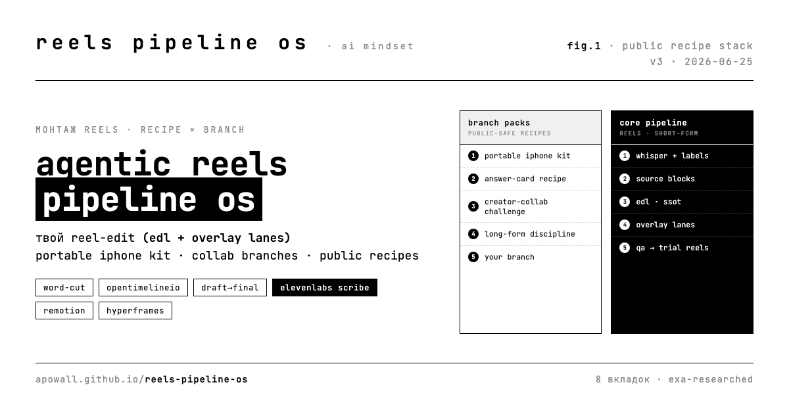

# AI Mindset Reels Pipeline OS

> **Open community stack for agentic short-form (Reels) editing.**
> Live: https://apowall.github.io/reels-pipeline-os/

Portable editing OS you **fork, configure, and contribute back to**. It started as a small Shaper dashboard prototype; now it is a public package of Reels pipeline contracts, branches, and install recipes.



## Start here

| file | what |
|------|------|
| **[STACK.md](STACK.md)** | the whole stack – every layer, tools, contracts, EDL schema, the skills, how to run it. Download this. |
| **[CONTRIBUTING.md](CONTRIBUTING.md)** | how to add your branch / example / improvement (+ the no-personal-data rule) |
| **[index.html](index.html)** | the live dashboard (single static file) |

## The dashboard

| tab | shows |
|-----|-------|
| **как работает** | the stack in 30 seconds: transcript → source blocks → EDL → overlays → draft → QA → final |
| **конфигуратор** | choose the branch pack for your use case and copy the install/checklist |
| **подходы** | different reusable approaches: long-form discipline, portable iPhone kit, our Reels OS |
| **короткий формат** | how long-form and portable kits change when they become short-form Reels |
| **живой пример** | a sanitized worked recipe: source blocks → EDL strip → overlay lanes → QA → branch surface |
| **заимствуем** | six borrows ranked by leverage + our moat |
| **развитие** | target merged architecture + roadmap |
| **технологии** | EXA-researched technology matrix (Remotion, OTIO, Hyperframes, X-Cut, Scribe, …) |

Keyboard: `1`–`8` switch tabs · `d` toggle dark/light.

## The idea in one line

A short-form editor should store the **recipe** first: source blocks + EDL + overlay lanes + QA/audio. The final mp4 becomes an output of a pinned, reproducible, forkable editing state.

## Branches so far

- **long-form discipline** – cut plan as SSOT, draft→final, transcript precision
- **our reels** – visual block editor, mode/style library, audio-first lip-sync
- **answer-card** – a sanitized worked recipe-example (overlay density ladder: clean → captions → micro → low-rail → soft-card)
- **creator-collab-challenge** – public follower-growth challenge recipe: metrics schema + collab reel mechanics + privacy boundary
- **portable-iphone-kit** – public-safe branch inspired by `Voronik1801/reel_pipline`: macOS/iPhone color discipline, templates, preflight, stutter/dead-air QA
- **your branch** – next. See [CONTRIBUTING.md](CONTRIBUTING.md).

## Configurator

Pick a pack before you edit:

| use case | start with | add |
|----------|------------|-----|
| one personal talking-head reel | `reel-edit` + `portable-iphone-kit` | `inside-insanity` for Alex-style voice/visual DNA |
| reusable block/timeline workflow | `reel-edit` + `reel-block-edit` | EDL export + overlay density ladder |
| public package / dashboard | `stack-compare` | sanitized branches only, no personal data |
| collab/challenge reel | `creator-collab-challenge` | aggregate public metrics, interruption-preserving EDL |

## Creator-collab challenge branch

The current public branch is a **sanitized challenge mechanic**. It describes how two creators can run a public Reels/Instagram challenge with:

- follower baseline/current/delta;
- content count and publish cadence;
- preparation time in minutes;
- `paid_ads_allowed: false`;
- a loser/winner public-post stake;
- a reusable collab-reel EDL pattern that preserves live interruptions and handoffs.

Real names, handles, private screenshots, raw footage, local paths, and secrets stay outside this repo. Code here is a **pipeline skeleton and public recipe** only; provider keys live in local environment variables.

## Portable iPhone kit branch

This branch distills what is useful from the public `Voronik1801/reel_pipline` repo:

- `pipeline_check` before creative work;
- Apple `avconvert` for iPhone HDR→SDR color;
- copy-and-fill shoot templates;
- stutter/dead-air detectors;
- cover/finale/music as replaceable identity slots.

It is packaged as transferable mechanics, with private creator style kept outside the public repo.

## Fork the dashboard as your own pipeline

One `index.html`, no build step. Copy it, edit the header/thesis and the two pipeline columns, keep the Shaper design tokens (`:root` block – pure B&W, JetBrains Mono, 1px frames). Regenerate the social cover from `assets/og-cover.src.html`.

## Publish your own

```bash
gh repo create <you>/<name> --public --source=. --push
gh api -X POST repos/<you>/<name>/pages -f 'source[branch]=main' -f 'source[path]=/'
```

---

Built with Claude Code + Codex via EXA MCP. Aesthetic: AI Mindset Shaper. **No personal data in public artifacts – mechanics only.**
